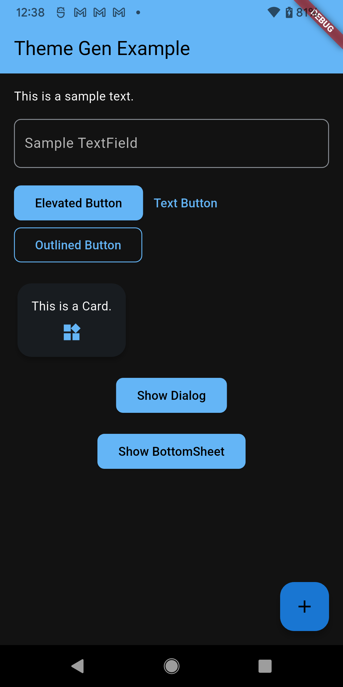
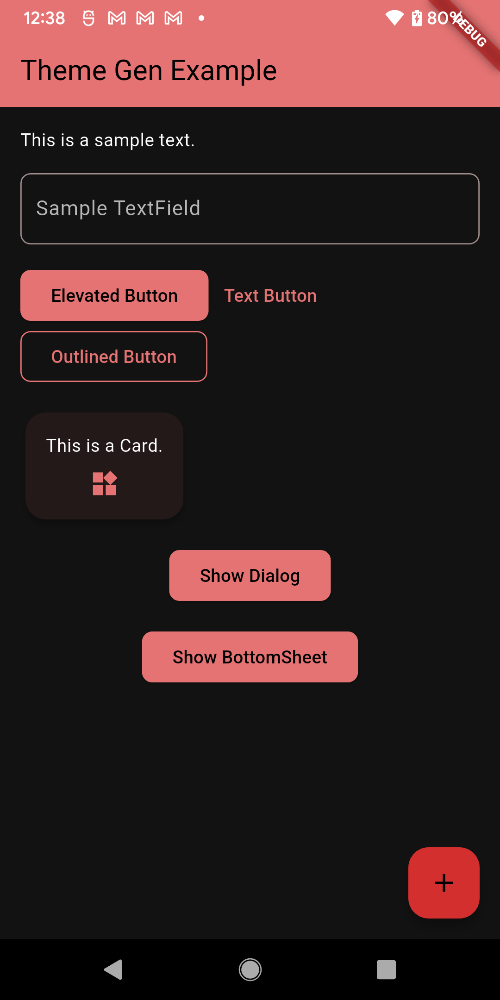
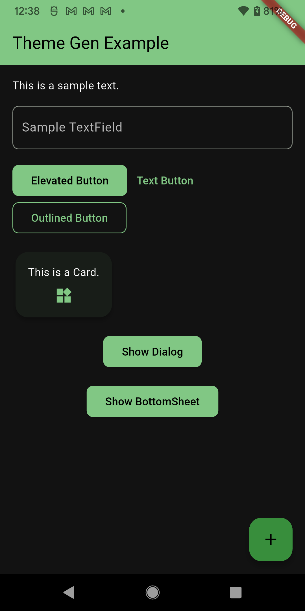

<!-- 
This README describes the package. If you publish this package to pub.dev,
this README's contents appear on the landing page for your package.

For information about how to write a good package README, see the guide for
[writing package pages](https://dart.dev/tools/pub/writing-package-pages). 

For general information about developing packages, see the Dart guide for
[creating packages](https://dart.dev/guides/libraries/create-packages)
and the Flutter guide for
[developing packages and plugins](https://flutter.dev/to/develop-packages). 
-->

# Theme Gen

A Flutter package to simplify theme management with a set of beautiful, predefined themes and a simple API for generating new themes dynamically from a single color.

## Features

- **Predefined Themes**: A collection of ready-to-use themes for both light and dark modes.
- **Dynamic Theme Generation**: Create a full light or dark `ThemeData` object at runtime from any `Color`.
- **Consistent UI**: Themes are designed to provide a consistent look and feel across all major Flutter widgets.
- **Easy to Use**: A simple, clean API that gets you up and running in seconds.

## Installation

Add this to your `pubspec.yaml` file's dependencies:

```yaml
dependencies:
  theme_kit: ^1.0.0 # Replace with the latest version
  hexcolor: ^3.0.1 # Required for the example
```

Then, run `flutter pub get` in your terminal.

## Usage

### 1. Using a Predefined Theme

You can easily apply one of the built-in themes to your `MaterialApp`.

```dart
import 'package:flutter/material.dart';
import 'package:theme_kit/theme_kit.dart';

void main() => runApp(const MyApp());

class MyApp extends StatelessWidget {
  const MyApp({super.key});

  @override
  Widget build(BuildContext context) {
    return MaterialApp(
      title: 'Theme Gen Example',
      // Access light themes
      theme: AppTheme.light.blue,
      // Access dark themes
      darkTheme: AppTheme.dark.blue,
      themeMode: ThemeMode.system,
      home: const MyHomePage(),
    );
  }
}
```

**Available Predefined Themes:**

- `AppTheme.light.blue` / `AppTheme.dark.blue`
- `AppTheme.light.red` / `AppTheme.dark.red`
- `AppTheme.light.green` / `AppTheme.dark.green`
- `AppTheme.light.purple` / `AppTheme.dark.purple`
- `AppTheme.light.blackAndWhite` / `AppTheme.dark.blackAndWhite`

### 2. Generating a Custom Theme Dynamically

Create a complete theme on the fly from a single color. This is perfect for letting users select their own theme color.

```dart
import 'package:flutter/material.dart';
import 'package:theme_kit/theme_kit.dart';
import 'package:hexcolor/hexcolor.dart';

class MyDynamicApp extends StatelessWidget {
  const MyDynamicApp({super.key});

  @override
  Widget build(BuildContext context) {
    // Generate a theme from any color
    final myCustomColor = HexColor('#8e44ad'); // A nice purple

    return MaterialApp(
      title: 'Theme Gen Dynamic Example',
      // Generate the light theme
      theme: AppTheme.getCustomTheme(primaryColor: myCustomColor),
      // Generate the dark theme
      darkTheme: AppTheme.getCustomDarkTheme(primaryColor: myCustomColor),
      themeMode: ThemeMode.system,
      home: const MyHomePage(),
    );
  }
}
```

### Theme Previews

| Blue Theme                                           | Red Theme                                         | Green Theme                                           |
| ---------------------------------------------------- | ------------------------------------------------- | ----------------------------------------------------- |
|  |  |  |

## Example App

The included example app is the best way to see the package in action. It demonstrates:
- Switching between all predefined light and dark themes.
- Using a text field to generate and apply a custom theme from any hex color at runtime.

To run the example app:

```sh
cd example
flutter run
```

This will launch the app on your connected device or simulator.

## Additional Information

- For more details on the API, check out the [API Documentation](doc/api/index.html).
- If you find any issues or have a feature request, please file them on the [GitHub repository](https://github.com/your-repo/theme_kit).
